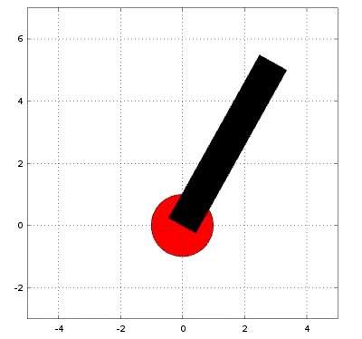
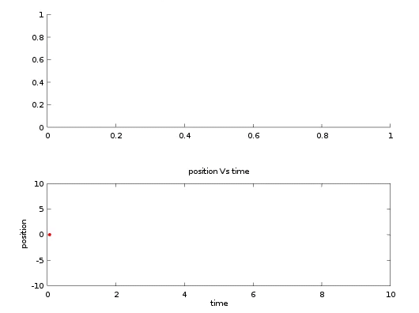

# Self-Balancing-Robot-with-PSO-based-self-tuned-PID-controller
Self Balancing Robot with PSO based self tuned PID controller. 
* Self-balancing robot is simulated as follows:

* Plot of tilt angle and position w.r.t. time is as follows:
 

## Dependencies 
* Matlab 2014a

## Files description
* cost.m     : It contains the cost function which is minimized by PSO and cost is taken is the sum of theta in each iteration
* pd_tune.m : It contains PSO code for tuning PD gains and I-gain is taken 0 as it is not needed at all in this case.
* Self_balancing_robot_simulation.m : It is the main file that simulates the actual self balancing robot
## Contributors  
 - Rahul Kumar, Sajan Kumar  
 ## License & copyright
 © Rahul Kumar 2019    
 Licensed under the [MIT License](LICENSE)
